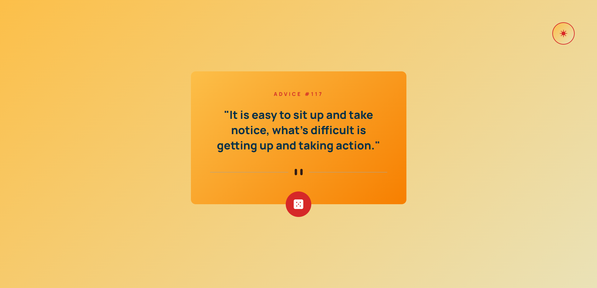

# Frontend Mentor - Advice generator app solution

This is a solution to the [Advice generator app challenge on Frontend Mentor](https://www.frontendmentor.io/challenges/advice-generator-app-QdUG-13db).

## Table of contents

- [Overview](#overview)
  - [The challenge](#the-challenge)
  - [Screenshot](#screenshot)
  - [Links](#links)
- [My process](#my-process)
  - [Built with](#built-with)
  - [What I learned](#what-i-learned)
  - [Useful resources](#useful-resources)
- [Author](#author)

## Overview

### The challenge

Users should be able to:

- View the optimal layout for the app depending on their device's screen size
- See hover states for all interactive elements on the page
- Generate a new piece of advice by clicking the dice icon

### Screenshot




### Links

- Solution URL: [Github](https://github.com/doganfurkan/advice-generator-app-main)
- Live Site URL: [Live](https://doganfurkan.github.io/advice-generator-app-main)

## My process

### Built with

- Semantic HTML5 markup
- CSS custom properties
- Flexbox
- Mobile-first workflow
- Fetch API

### What I learned

This is the 2nd time I'm using picture tag to show different images for different screen sizes.

```html
      <picture>
        <source media="(min-width: 500px)" srcset="./images/pattern-divider-desktop.svg">
        
      </picture>
```

This is the first time I'm using cache property for fetchAPI

```js
  await fetch("https://api.adviceslip.com/advice",{ cache: "no-cache" })
```


### Useful resources

- [Cache Property](https://developer.mozilla.org/en-US/docs/Web/API/Request/cache) - This is the link for cache property at Mozilla's website.

## Author

- Github - [@doganfurkan](https://www.github.com/doganfurkan)
- Frontend Mentor - [@doganfurkan](https://www.frontendmentor.io/profile/doganfurkan)